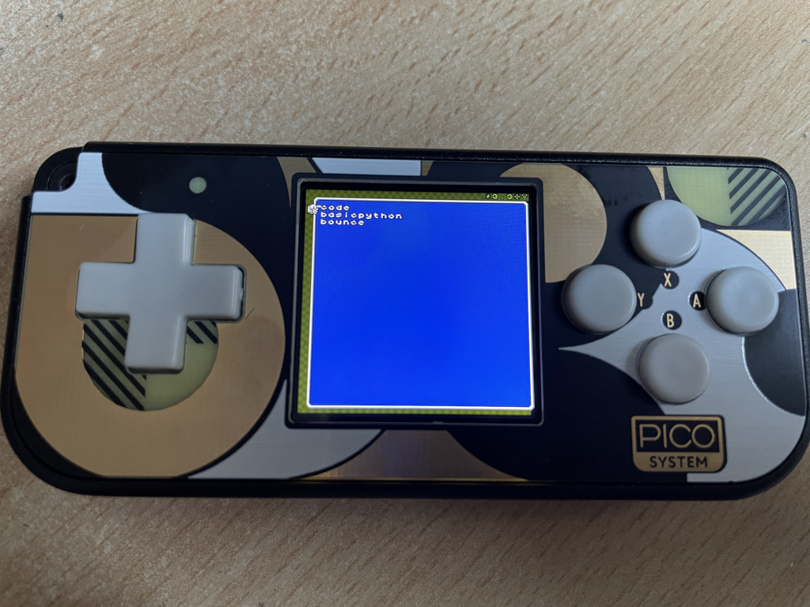

# picosystem
Experiment, code, tutorial around the PicoSystem console from Pimoroni

  

Tests made on Picosystem with CircuitPython 7.0 with Stage included: 
build [Adafruit CircuitPython 7.0.0-475-g2736b46f8 on 2021-10-16; Pimoroni PicoSystem with rp2040](https://adafruit-circuit-python.s3.amazonaws.com/bin/pimoroni_picosystem/fr/adafruit-circuitpython-pimoroni_picosystem-fr-20211016-2736b46.uf2)

I will update with official release as soon as it is included.

Each folder contains a Readme file to explain what you can find.